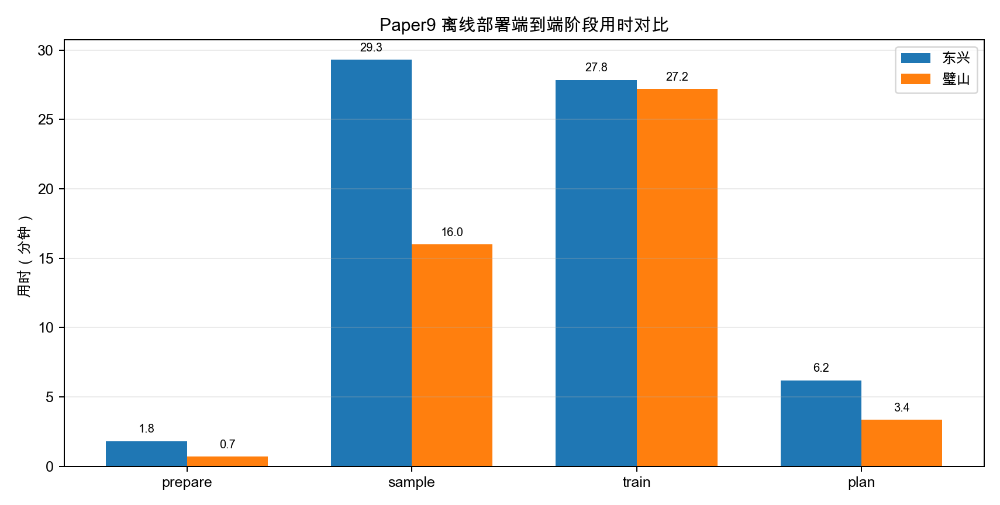
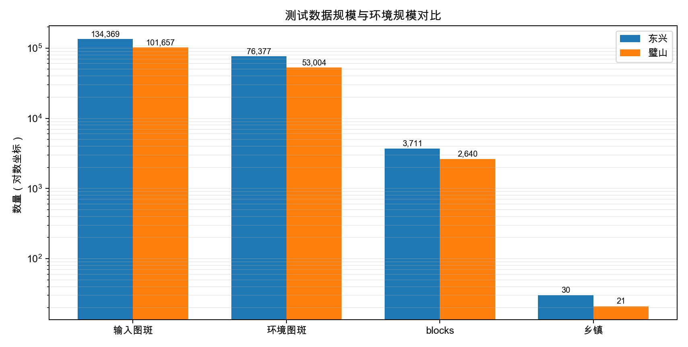
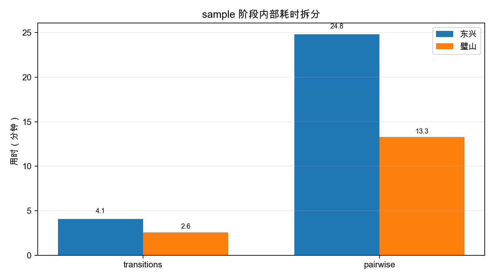
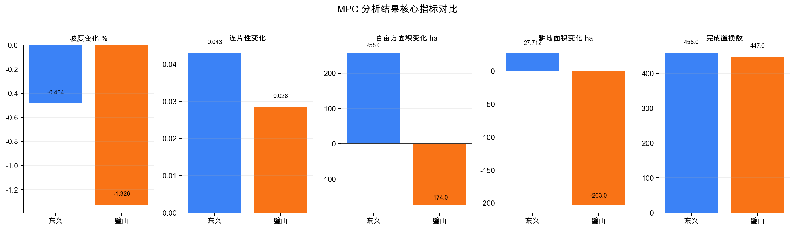

# Paper9 离线部署包双数据集端到端测试报告

生成时间：2026-06-27 15:27:11

## 1. 测试结论

本报告汇总 Paper9 自然资源部离线部署包在东兴与璧山两套县域数据上的正式端到端测试。两次测试均使用正式配置 `configs/real_data_from_authority_slope.yml`，覆盖 `prepare -> sample -> train -> plan -> audit` 全流程。

| 数据集 | run_id | 容器架构 | run 状态 | audit | 总用时 min |
| --- | --- | --- | --- | --- | --- |
| 东兴 | 20260625-142307 | linux/amd64 | ok | 通过 | 65.16 |
| 璧山 | 20260627-062432 | linux/arm64 | ok | 通过 | 47.29 |

## 2. 测试数据情况

| 数据集 | DLTB 来源 | DEM/占位 DEM | 输入图斑 | 有坡度图斑 | 原始 CRS/说明 | 行政代码分布 |
| --- | --- | --- | --- | --- | --- | --- |
| 东兴 | /Users/zhouning/paper4-county-marl-farmland-consolidation/data/dongxing/derived/DLTB_with_slope.gpkg | data/input/DEM_placeholder.tif | 134369 | 134369 | GeoPackage 输入，prepare 阶段投影到 EPSG:32648 | 主前缀 511011，共 134,368 条；另有 512021 1 条边界图斑。 |
| 璧山 | /Users/zhouning/Downloads/bishan/DLTB_with_slope.gpkg | /Users/zhouning/Downloads/bishan/Copernicus_DSM_COG_10_N29_00_E106_00_DEM.tif | 101657 | 101657 | EPSG:4326 | 主前缀 500227，共 100,833 条；另含 500106/500107/500109/500116 等少量边界或飞地图斑。 |

说明：两套数据均以 `slope.source=field` 路径运行，坡度来自 DLTB 属性字段 `slope_mean`；DEM 文件保留为接口输入，不参与坡度重算。东兴输入为既有 Paper9 代理自然资源部输入，璧山输入为本次独立生成的挂载目录。

## 3. 测试过程

### 3.1 流程与参数

| 参数项 | 值 |
| --- | --- |
| 配置 | `configs/real_data_from_authority_slope.yml` |
| 目标 CRS | `EPSG:32648` |
| 采样 | `n_episodes=60`, `n_states=1000`, `n_actions=50` |
| 训练 | `n_members=3`, `epochs=30`, `batch_size=256`, `lambda_rank=5.0` |
| 规划 | `horizon=5`, `top_k=50`, `mpc_batch_size=1024`, `n_episodes=1` |
| 奖励权重 | `slope=4100`, `cont=600`, `baimu=2300`, `baimu_bonus=9`, `baimu_area_penalty=3100` |

### 3.2 阶段用时

| 数据集 | prepare | sample | train | plan | 总用时 |
| --- | --- | --- | --- | --- | --- |
| 东兴 | 108.913s | 1757.748s | 1670.922s | 371.855s | 3909.444s |
| 璧山 | 42.351s | 961.138s | 1632.169s | 201.882s | 2837.544s |

| 数据集 | transitions | transitions 用时 | pairwise | pairwise 用时 | reward std median |
| --- | --- | --- | --- | --- | --- |
| 东兴 | 6000 | 243.900s | 1000 x 50 | 1489.100s | 0.2140 |
| 璧山 | 6000 | 154.100s | 1000 x 50 | 796.300s | 0.6777 |

## 4. 分析结果

| 数据集 | 候选乡镇 | 处理乡镇 | 跳过乡镇 | blocks | 环境图斑 | 初始坡度 | 初始连片性 | 初始百亩方数 |
| --- | --- | --- | --- | --- | --- | --- | --- | --- |
| 东兴 | 30 | 29 | 1 | 3711 | 76377 | 10.5352 | 2.6314 | 384 |
| 璧山 | 21 | 21 | 0 | 2640 | 53004 | 9.6231 | 3.5794 | 110 |

| 数据集 | 成员数 | 训练总耗时 | 平均 ranking_acc | best_val_loss min | best_val_loss max |
| --- | --- | --- | --- | --- | --- |
| 东兴 | 3 | 1659.500s | 0.8558 | 0.5901 | 0.7788 |
| 璧山 | 3 | 1624.700s | 0.8906 | 0.4934 | 0.6479 |

| 数据集 | 坡度变化 | 连片性变化 | 百亩方数变化 | 百亩方面积 ha | 耕地面积 ha | 耕地面积 % | 完成置换 | farm->forest | forest->farm |
| --- | --- | --- | --- | --- | --- | --- | --- | --- | --- |
| 东兴 | -0.484% | +0.0430 | -1 | +257.98 | +27.71 | +0.0355% | 458 | 458 | 458 |
| 璧山 | -1.326% | +0.0285 | 4 | -174.02 | -203.04 | -0.4206% | 447 | 447 | 447 |

结果解读：

- 东兴数据规模更大，进入环境图斑 76,377、blocks 3,711，因此 sample 和 plan 阶段耗时明显高于璧山。
- 璧山数据输入图斑较少，环境 blocks 2,640；sample 阶段和 plan 阶段更快，但训练阶段与东兴接近，主要由 3 个成员、30 epoch 和相似的神经网络规模决定。
- 两套数据均降低平均坡度并提高连片性。东兴的百亩方面积增加 257.98 ha，璧山的百亩方面积减少 174.02 ha，但璧山百亩方数量增加 4；该差异说明两地候选块空间结构和 reward 权衡不同，不能只看单项面积指标。
- 东兴耕地面积小幅增加 27.71 ha；璧山耕地面积减少 203.04 ha。若正式业务要求耕地面积不减少，应启用或强化 `cultivated_area_floor_delta_ha` 约束后重新测试。

## 5. Audit 与产物

| 数据集 | prepared | transitions | pairwise | tool3 | plan | optimized_vector |
| --- | --- | --- | --- | --- | --- | --- |
| 东兴 | True | True | True | True | True | True |
| 璧山 | True | True | True | True | True | True |

| 数据集 | run manifest | prepare summary | sample summary | train summary | MPC summary | audit |
| --- | --- | --- | --- | --- | --- | --- |
| 东兴 | `outputs/full_real_data_20260625_run2/logs/run_full_pipeline-20260625-142307.json` | `data/working/full_real_data_20260625_run2/prepared/prepare_data_summary.json` | `data/working/full_real_data_20260625_run2/prepared/tool2/sample_transitions_summary.json` | `data/working/full_real_data_20260625_run2/prepared/tool3/train_summary.json` | `outputs/full_real_data_20260625_run2/plan/mpc_summary.json` | `outputs/full_real_data_20260625_run2/audit_summary.json` |
| 璧山 | `outputs/bishan_e2e_20260627/logs/run_full_pipeline-20260627-062432.json` | `data/working/bishan_e2e_20260627/working/prepared/prepare_data_summary.json` | `data/working/bishan_e2e_20260627/working/prepared/tool2/sample_transitions_summary.json` | `data/working/bishan_e2e_20260627/working/prepared/tool3/train_summary.json` | `outputs/bishan_e2e_20260627/plan_baseline/mpc_summary.json` | `outputs/bishan_e2e_20260627/audit_summary.json` |

## 6. Warning 与风险说明

- 两次测试均有 DBF 字段名截断、局部连通性组件/islands、`RuntimeWarning: invalid value encountered in divide` 等非致命 warning。
- 训练阶段 ONNX version converter fallback 会打印 traceback，但 3 个 ONNX 均完成导出并通过 parity 校验；流程 returncode 仍为 0。
- plan 阶段存在 `baimu_area_penalty=3100.0` reward override 提示：当前 scoring=reward 时，真正影响候选排序的是已训练 ensemble 的 reward_head；若要让新权重改变规划策略，需要按该权重重新训练。
- 东兴 prepare 中 `511011214` 因无可用 blocks 被跳过；audit 与后续阶段仍通过。
- 璧山输入中的行政参考层为本次由 `QSDWDM` 9 位前缀 dissolve 生成的代理层，适合离线包工程测试，不等价于客户正式行政区权威数据。

