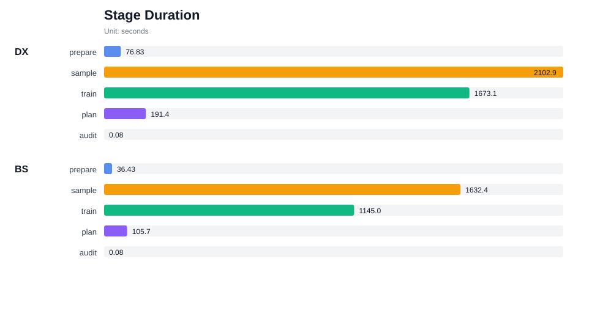
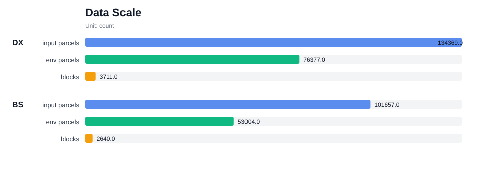
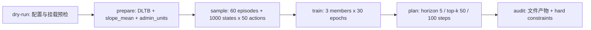
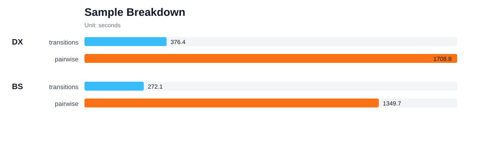
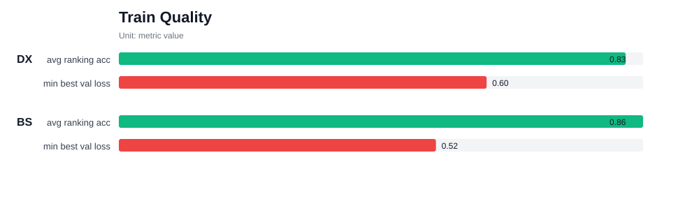
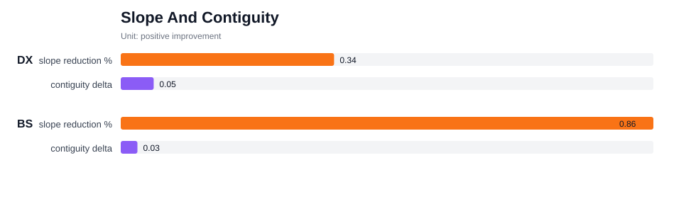
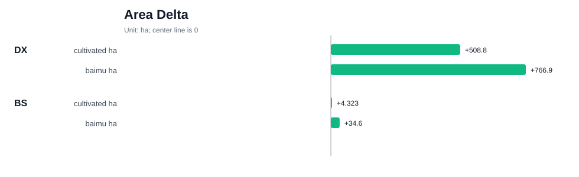

# Paper9v2 Docker 离线部署包双数据集端到端测试报告

生成时间：2026-06-28 01:57:08

## 1. 测试结论

本报告汇总 Paper9v2 自然资源部离线部署包在东兴与璧山两套县域数据上的 Docker 正式端到端测试。两次测试均使用 `configs/paper9v2_no_net_loss_authority_slope.yml`，覆盖 `prepare -> sample -> train -> plan -> audit` 全流程，并在 audit 阶段验证 hard gate：县域耕地总面积不减少、耕地平均坡度降低、连片度上升。

| 数据集 | run_id | Docker 镜像 | run 状态 | audit | 总用时 min |
| --- | --- | --- | --- | --- | --- |
| 东兴 | 20260627-155224 | paper9-mnr-offline:paper9v2-2.0.0-arm64 | ok | 通过 | 67.40 |
| 璧山 | 20260627-170016 | paper9-mnr-offline:paper9v2-2.0.0-arm64 | ok | 通过 | 48.66 |

结论：两套数据的正式 E2E 均为 `ok`，audit 均通过。Paper9v2 在本次 Docker 离线部署测试中满足“耕地总面积不减少、平均坡度降低、连片度上升”的核心业务约束；百亩方不是 hard gate，但两套数据的百亩方面积也均为正增长。

## 2. 测试环境与镜像版本

| 项目 | 值 |
| --- | --- |
| 运行环境 | Docker / arm64 |
| 镜像 | `paper9-mnr-offline:paper9v2-2.0.0-arm64` |
| 包版本 | 0.2.0 |
| 算法 | paper9v2 2.0.0 |
| 镜像 revision | a58fa3ad15c9 |
| 镜像 created | 2026-06-27T15:47:23Z |
| 配置 | `configs/paper9v2_no_net_loss_authority_slope.yml` |

正式运行前已执行 dry-run 预检，两个数据集的阶段编排、挂载目录、配置解析均通过：

| 数据集 | dry-run run_id | 状态 |
| --- | --- | --- |
| 东兴 | 20260627-154919 | ok |
| 璧山 | 20260627-154947 | ok |

## 3. 测试数据情况

两套数据均走 `slope_method=from_field`，坡度来自 DLTB 属性字段 `slope_mean`；DEM 文件作为离线包接口输入保留，不参与本轮坡度重算。prepare 阶段统一投影到 `EPSG:32648`。

| 数据集 | DLTB | 行政参考 | DEM | 输入图斑 | 候选乡镇 | 环境图斑 | blocks |
| --- | --- | --- | --- | --- | --- | --- | --- |
| 东兴 | `data/input/DLTB_with_authority_slope.gpkg` (181.1 MB) | `data/input/admin_units.gpkg` (19.8 MB) | `data/input/DEM_placeholder.tif` (1.4 KB) | 134369 | 30 | 76377 | 3711 |
| 璧山 | `data/working/bishan_e2e_20260627/input/DLTB_with_authority_slope.gpkg` (153.1 MB) | `data/working/bishan_e2e_20260627/input/admin_units.gpkg` (1.5 MB) | `data/working/bishan_e2e_20260627/input/DEM_placeholder.tif` (44.5 MB) | 101657 | 21 | 53004 | 2640 |

数据说明：

- 东兴：既有 Paper9 离线包输入目录，DLTB 已带 slope_mean 权威坡度字段。
- 璧山：本次为 Docker E2E 准备的璧山挂载输入目录，DLTB 已带 slope_mean 权威坡度字段。

## 4. 测试过程

核心参数：

| 参数项 | 值 |
| --- | --- |
| 目标 CRS | `EPSG:32648` |
| 采样 | `n_episodes=60`, `n_states=1000`, `n_actions=50` |
| 训练 | `n_members=3`, `epochs=30`, `batch_size=256`, `lambda_rank=5.0`, `patience=8` |
| 规划 | `horizon=5`, `top_k=50`, `mpc_batch_size=1024`, `n_episodes=1`, `max_steps=100` |
| 奖励权重 | `slope=4100`, `cont=600`, `baimu=2300`, `baimu_bonus=9`, `baimu_area_penalty=3100` |
| 硬约束 | `cultivated_area_floor_delta_ha=0`; audit 同时要求坡度下降、连片度上升 |

### 4.1 阶段用时

| 数据集 | prepare | sample | train | plan | audit | 总用时 |
| --- | --- | --- | --- | --- | --- | --- |
| 东兴 | 76.829s | 2102.909s | 1673.070s | 191.410s | 0.076s | 4044.299s |
| 璧山 | 36.434s | 1632.444s | 1144.977s | 105.687s | 0.078s | 2919.626s |

### 4.2 Sample 阶段拆分

| 数据集 | transitions | transitions 用时 | pairwise | pairwise 用时 | reward std median | reward mean |
| --- | --- | --- | --- | --- | --- | --- |
| 东兴 | 6000 | 376.400s | 1000 x 50 | 1708.800s | 0.0854 | 0.2601 |
| 璧山 | 6000 | 272.100s | 1000 x 50 | 1349.700s | 0.6789 | 0.1855 |

## 5. 分析结果

### 5.1 Prepare 与环境规模

| 数据集 | 候选乡镇 | 处理乡镇 | 跳过乡镇 | blocks | 环境图斑 | 初始坡度 | 初始连片性 | 初始百亩方数 |
| --- | --- | --- | --- | --- | --- | --- | --- | --- |
| 东兴 | 30 | 29 | 1 | 3711 | 76377 | 10.5352 | 2.6314 | 384 |
| 璧山 | 21 | 21 | 0 | 2640 | 53004 | 9.6231 | 3.5794 | 110 |

### 5.2 训练结果

| 数据集 | 成员数 | 训练总耗时 | 平均 ranking_acc | best_val_loss min | best_val_loss max |
| --- | --- | --- | --- | --- | --- |
| 东兴 | 3 | 1663.200s | 0.8323 | 0.60392 | 0.78287 |
| 璧山 | 3 | 1137.600s | 0.8608 | 0.52069 | 0.58125 |

| 数据集 | member | 耗时 | best_epoch | best_val_loss | ranking_acc | cos_sim |
| --- | --- | --- | --- | --- | --- | --- |
| 东兴 | 0 | 554.400s | 29 | 0.77946 | 0.8112 | 0.999824 |
| 东兴 | 1 | 550.600s | 25 | 0.78287 | 0.8488 | 0.999799 |
| 东兴 | 2 | 555.800s | 30 | 0.60392 | 0.8369 | 0.999839 |
| 璧山 | 0 | 394.000s | 30 | 0.58125 | 0.8776 | 0.999689 |
| 璧山 | 1 | 342.100s | 17 | 0.52069 | 0.8589 | 0.999321 |
| 璧山 | 2 | 399.200s | 29 | 0.56312 | 0.8459 | 0.999736 |

### 5.3 MPC 与 audit 结果

| 数据集 | 耕地面积变化 ha | 耕地面积变化 % | 坡度变化 | 连片度变化 | 百亩方数变化 | 百亩方面积变化 ha | 完成置换 |
| --- | --- | --- | --- | --- | --- | --- | --- |
| 东兴 | 508.783 | 0.6509% | -0.3431% | 0.0530 | -23 | 766.871 | 475 |
| 璧山 | 4.323 | 0.0090% | -0.8564% | 0.0268 | 1 | 34.638 | 424 |

结果解读：

- 东兴：完成 475 次等量置换，耕地面积增加 508.783 ha，平均坡度下降 0.3431%，连片度提升 0.0530，百亩方面积增加 766.871 ha。
- 璧山：完成 424 次等量置换，耕地面积增加 4.323 ha，平均坡度下降 0.8564%，连片度提升 0.0268，百亩方面积增加 34.638 ha。
- 两套数据都达成 Paper9v2 的 hard gate；百亩方指标虽不是硬约束，但本次结果也没有出现百亩方面积下降。

### 5.4 与旧版 Paper9 报告的回归对照

下表仅用于和既有报告 `outputs/paper9_offline_bishan_dongxing_report_20260627/REPORT.md` 的结果做业务回归对照；旧版和本次配置不完全相同，不能作为严格算法消融。

| 数据集 | 旧版耕地 ha | v2 耕地 ha | 旧版坡度 | v2 坡度 | 旧版连片 | v2 连片 | 旧版百亩方面积 ha | v2 百亩方面积 ha |
| --- | --- | --- | --- | --- | --- | --- | --- | --- |
| 东兴 | 27.71 | 508.78 | -0.484% | -0.343% | 0.0430 | 0.0530 | 257.98 | 766.87 |
| 璧山 | -203.04 | 4.32 | -1.326% | -0.856% | 0.0285 | 0.0268 | -174.02 | 34.64 |

关键变化：旧版 Paper9 在璧山上出现耕地面积 -203.04 ha，本次 Paper9v2 通过 `cultivated_area_floor_delta_ha=0` 和 audit hard gate 将璧山耕地面积变化控制为 +4.32 ha；东兴耕地面积由旧版 +27.71 ha 提高到 +508.78 ha，同时连片度和百亩方面积也提高。代价是两套数据的坡度降幅较旧版略小，属于“面积不减少”硬约束后的合理权衡。

## 6. Audit 与产物

| 数据集 | run manifest | prepare summary | sample summary | train summary | MPC summary | audit |
| --- | --- | --- | --- | --- | --- | --- |
| 东兴 | `outputs/paper9v2_docker_e2e_20260627/dongxing/logs/run_full_pipeline-20260627-155224.json` | `data/working/paper9v2_docker_e2e_20260627/dongxing/prepared_paper9v2_no_net_loss/prepare_data_summary.json` | `data/working/paper9v2_docker_e2e_20260627/dongxing/prepared_paper9v2_no_net_loss/tool2/sample_transitions_summary.json` | `data/working/paper9v2_docker_e2e_20260627/dongxing/prepared_paper9v2_no_net_loss/tool3/train_summary.json` | `outputs/paper9v2_docker_e2e_20260627/dongxing/plan_paper9v2_no_net_loss/mpc_summary.json` | `outputs/paper9v2_docker_e2e_20260627/dongxing/audit_summary.json` |
| 璧山 | `outputs/paper9v2_docker_e2e_20260627/bishan/logs/run_full_pipeline-20260627-170016.json` | `data/working/paper9v2_docker_e2e_20260627/bishan/prepared_paper9v2_no_net_loss/prepare_data_summary.json` | `data/working/paper9v2_docker_e2e_20260627/bishan/prepared_paper9v2_no_net_loss/tool2/sample_transitions_summary.json` | `data/working/paper9v2_docker_e2e_20260627/bishan/prepared_paper9v2_no_net_loss/tool3/train_summary.json` | `outputs/paper9v2_docker_e2e_20260627/bishan/plan_paper9v2_no_net_loss/mpc_summary.json` | `outputs/paper9v2_docker_e2e_20260627/bishan/audit_summary.json` |

两次 audit 均确认 expected outputs 完整，`prepared_dir`、`transitions.npz`、`pairwise.npz`、`tool3`、`plan`、`DLTB_optimized.shp`、`mpc_summary.json` 均存在。

## 7. Warning 与风险说明

- 两次测试均有 DBF 字段名截断、局部连通性组件/islands、`RuntimeWarning: invalid value encountered in divide` 等非致命 warning；流程 returncode 均为 0。
- 训练阶段 ONNX version converter fallback 会打印 traceback，但 6 个 ONNX 成员均完成导出并通过 parity 校验，最大差异在 `4.77e-07` 到 `7.15e-07` 量级。
- plan 阶段仍提示 `baimu_area_penalty=3100.0` reward override：当前 `scoring=reward` 时候选排序主要由已训练 ensemble 的 reward head 决定。本次 sample/train 已使用同一套 reward 权重，因此该提示不影响本次配置一致性；后续若临时改 plan 权重，应重新训练。
- 东兴 prepare 中 `511011214` 因无可用 blocks 被跳过；该乡镇不参与环境置换，audit 仍通过。
- 璧山输入行政参考层来自本次离线测试挂载目录，可用于工程 E2E 验证；正式交付时仍应替换为客户确认的权威行政单元数据。
